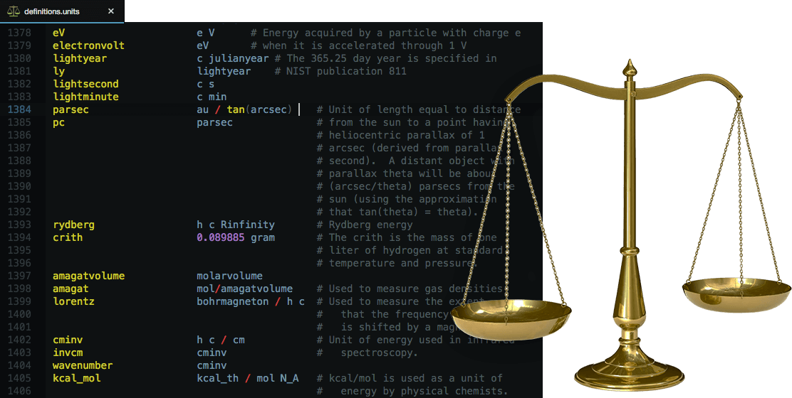

Highlighting for [`units`][1] definition files
==============================================

Adds syntax highlighting to the unit definition files used by [`units(1)`][2].

<!-- Referenced links -->
[1]: https://en.wikipedia.org/wiki/GNU_Units
[2]: https://linux.die.net/man/1/units
